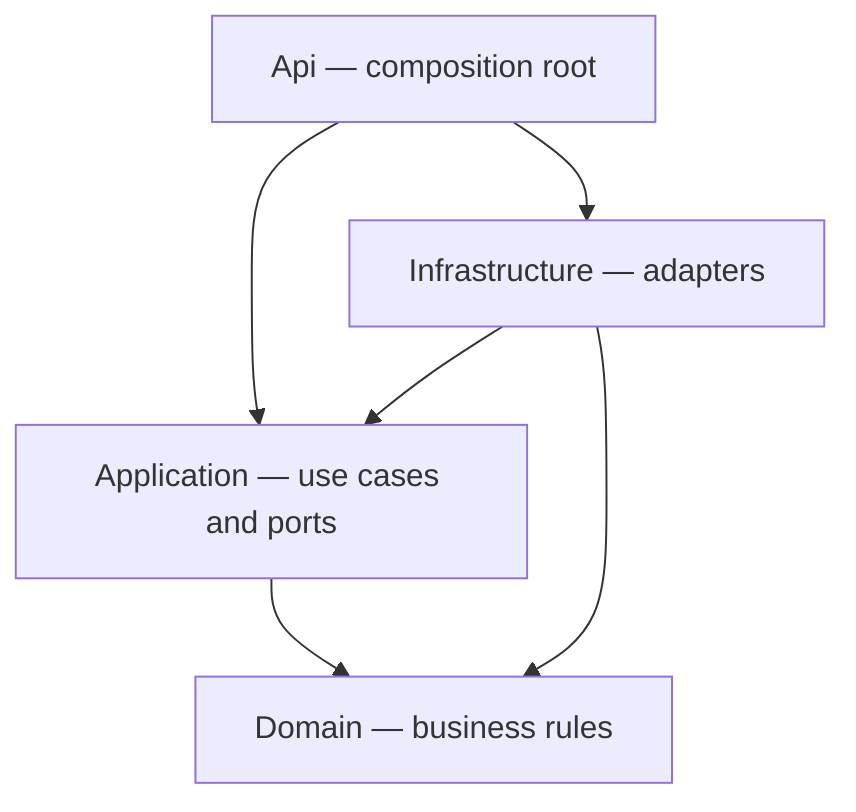
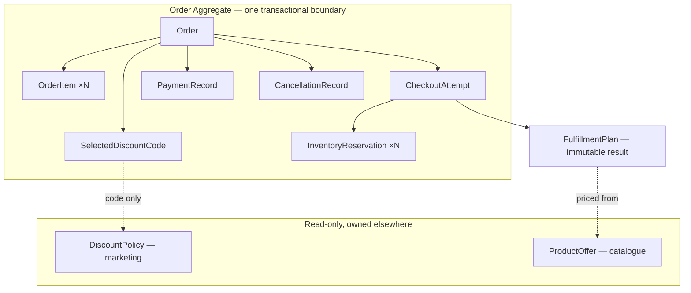
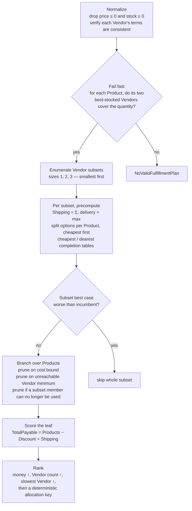
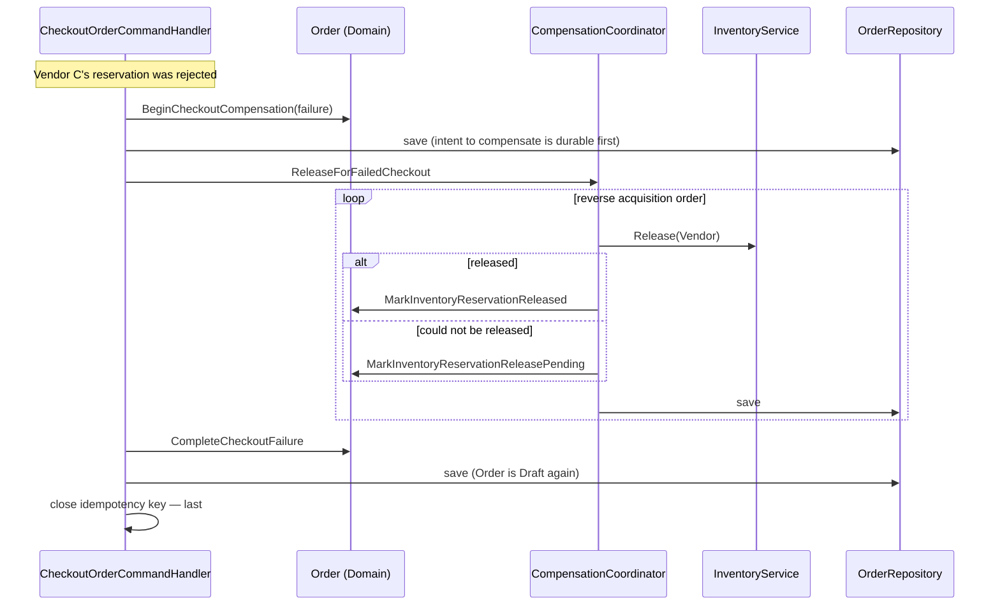
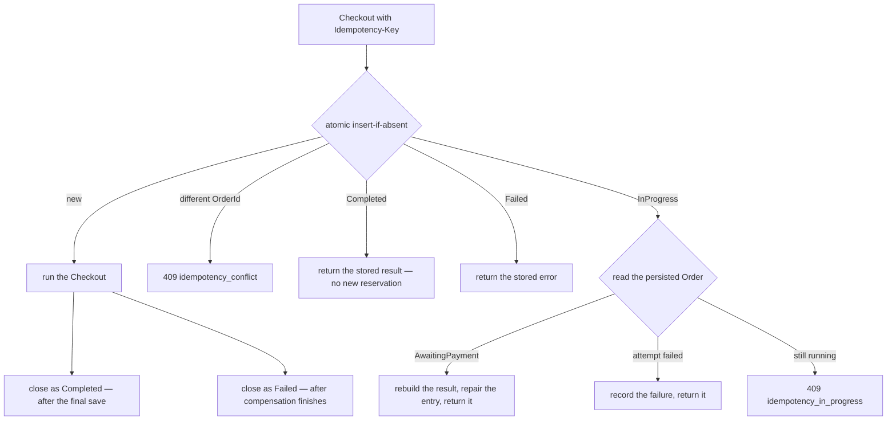
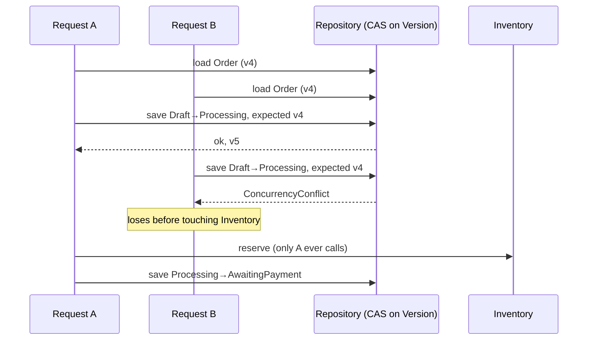
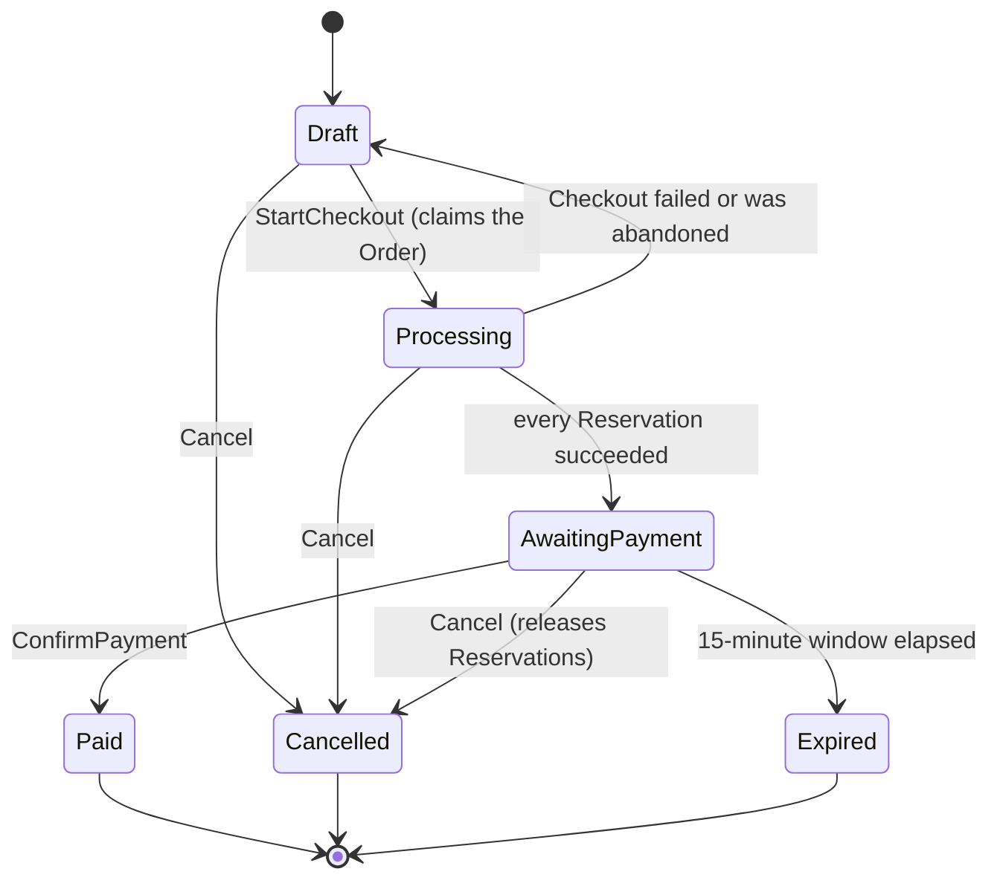
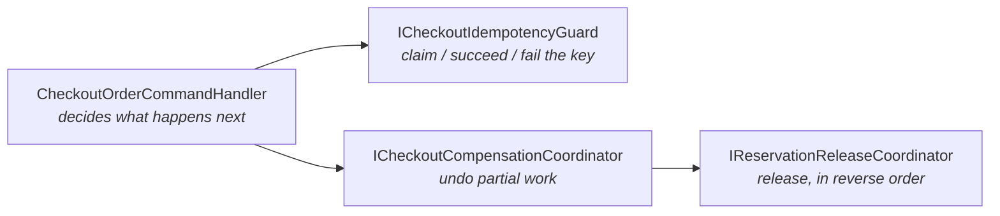

# MarketplaceOrdering

A multi-vendor ordering system built for a Senior Backend technical assignment: .NET 8, Clean Architecture, DDD.

A customer builds a Draft Order without prices. At Checkout the system asks every Vendor what it would charge, searches for the cheapest complete way to source the Order across at most three Vendors, applies the discount, reserves stock with each chosen Vendor, and moves the Order to payment. Any step can fail halfway, and the interesting part of the system is what happens when it does.

> فارسی: [README.fa.md](README.fa.md)

---

## Table of contents

**The twelve questions**

| | |
|---|---|
| [1. Aggregates](#q1) | what they are |
| [2. Aggregate boundaries](#q2) | why the boundaries fall there |
| [3. The allocation algorithm](#q3) | how the search works |
| [4. Complexity](#q4) | cost and the budget that bounds it |
| [5. Scaling the search](#q5) | what changes at 1000 Vendors |
| [6. Where compensation lives](#q6) | and why |
| [7. When a release fails](#q7) | four layers of recovery |
| [8. Idempotency](#q8) | claim, replay, conflict |
| [9. Concurrency](#q9) | the two-phase claim |
| [10. Production differences](#q10) | what is deliberately not real here |
| [11. Published events](#q11) | the event catalogue |
| [12. Observability](#q12) | what to log and measure |

**Design in depth**

| | |
|---|---|
| [Domain design](#domain) | value objects, the Aggregate, invariants, state machines, discounts |
| [Application design](#application) | use cases, ports, orchestration, the checkout collaborators |
| [Running it](#run) | build, test, Swagger, demo scenarios |
| [Structure](#structure) | projects and dependency direction |
| [A note on the assignment's example](#reference-example) | why it returns 625, not 635 |
| [Assumptions](#assumptions) · [Trade-offs](#tradeoffs) · [Testing](#tests) | |

---

<a id="run"></a>

## Running it

```bash
dotnet restore MarketplaceOrdering.sln
dotnet build   MarketplaceOrdering.sln
dotnet test    MarketplaceOrdering.sln      # 458 tests
dotnet run --project src/MarketplaceOrdering.Api
```

The API opens Swagger in Development. Suggested walkthrough:

1. `POST /api/demo/reset` — seeds the Vendors, Offers, and discount codes below.
2. `POST /api/orders` — Product A ×3 and Product B ×2.
3. `PUT /api/orders/{id}/discount` — optionally `SAVE10`.
4. `POST /api/orders/{id}/checkout` with an `Idempotency-Key` header.
5. `POST /api/orders/{id}/payments/confirm` — or cancel, or let it expire.
6. `GET /api/orders/{id}` and `GET /api/demo/outbox?orderId={id}`.

### Demo data

| | ID |
|---|---|
| Customer | `10000000-…-0001` |
| Product A / B | `20000000-…-0001` / `20000000-…-0002` |
| Vendor 1 / 2 / 3 | `30000000-…-0001` / `…-0002` / `…-0003` |

| Vendor | Offers | Shipping | Delivery |
|---|---|---|---|
| 1 | A @ 100 ×3 | 20 | 24h |
| 2 | B @ 150 ×2 | 15 | 24h |
| 3 | A @ 105 ×3, B @ 145 ×2 | 30 | 36h |

Both `Vendor 1 + Vendor 2` and `Vendor 3 alone` total **635**, so the tie-break on Vendor count decides and Vendor 3 wins. With `SAVE10` both total **575** and Vendor 3 still wins.

Discount codes: `SAVE10` (10%), `FIXED50` (fixed 50), `VENDOR3` (10%, Vendor 3 only), `INACTIVE` (rejected on apply).

### Failure scenarios

`POST /api/demo/scenarios/{name}` re-seeds and injects a failure:

| Scenario | What Vendor 3 does |
|---|---|
| `default` | behaves |
| `reservation-rejection` | refuses definitively — Checkout compensates and returns to Draft |
| `reservation-indeterminate` | the request never lands — Order stays claimed until recovery runs |
| `reservation-lost-response` | reserves for real, then loses the response — stock is held until recovery reads it back |
| `release-failure` | refuses to release — the Reservation becomes `ReleasePending` and is retried |

### Endpoints

```
POST   /api/orders                                     create
GET    /api/orders/{id}                                read
POST   /api/orders/{id}/items                          add item
PUT    /api/orders/{id}/items/{productId}              change quantity
DELETE /api/orders/{id}/items/{productId}              remove item
PUT    /api/orders/{id}/discount                       apply discount code
DELETE /api/orders/{id}/discount                       remove discount code
POST   /api/orders/{id}/checkout                       checkout   (Idempotency-Key header)
POST   /api/orders/{id}/checkout/abandon               recover a stuck Checkout
POST   /api/orders/{id}/payments/confirm               confirm payment
POST   /api/orders/{id}/cancel                         cancel
POST   /api/orders/{id}/expire                         expire
POST   /api/orders/{id}/reservation-releases/retry     retry pending releases
GET    /api/demo/outbox                                inspect committed Domain Events
POST   /api/demo/reservation-recovery/run              release orphan Reservations
```

---

<a id="structure"></a>

## Structure

```
src/
  MarketplaceOrdering.Domain           business rules, no dependencies
  MarketplaceOrdering.Application      use cases, ports, orchestration
  MarketplaceOrdering.Infrastructure   in-memory adapters
  MarketplaceOrdering.Api              controllers, error mapping, Swagger, demo seeding
tests/
  MarketplaceOrdering.Domain.Tests        263 tests
  MarketplaceOrdering.Application.Tests   144 tests
  MarketplaceOrdering.Api.Tests            51 tests
```



Domain references nothing but the BCL — no EF, no MediatR, no ASP.NET, no `DateTime.Now`. An architecture test asserts it.

The API layer is outside the assignment's required scope. It exists because a working Swagger endpoint makes the failure scenarios above reproducible rather than merely described, and because it proves the Application layer really is transport-agnostic. It is a thin adapter: controllers map HTTP to a request, call `ISender`, and map `Result` to a status code. No business rule lives there.

---

<a id="q1"></a>

## 1. What are the system's main Aggregates?

**`Order` is the only Aggregate Root.** Inside its boundary:

| Inside `Order` | What it is |
|---|---|
| `OrderItem` | ProductId, a ProductName snapshot, Quantity |
| `SelectedDiscountCode` | just the code and when it was chosen |
| `CheckoutAttempt` | one Checkout's planning, reservation, and compensation state |
| `InventoryReservation` | one Vendor's reservation, its expiry and release progress |
| `FulfillmentPlan` | the chosen allocation — immutable, derived |
| `PaymentRecord`, `CancellationRecord` | the facts of payment and cancellation |



`DiscountPolicy` and `ProductOffer` are Aggregate Roots of other contexts (marketing, catalogue). This system consumes them read-only through ports and never writes them. `IdempotencyEntry` is Application state with its own lifecycle, not part of any Aggregate.

Nothing inside the boundary has its own repository. Loading a Reservation without its Order would make it possible to change one without re-checking the rules that connect them.

<a id="q2"></a>

## 2. Why were these boundaries chosen for the Aggregates?

An Aggregate boundary is drawn by **the invariant that must hold at every commit**, not by class size. The decisive one here:

> An Order reaches `AwaitingPayment` only if *every* Vendor Reservation succeeded.

That rule spans the Order's status and all of its Reservations at once. If Reservations were a separate Aggregate, the rule could only be eventually consistent, which means a Saga and a compensating process manager for something the business treats as a single atomic decision. The assignment explicitly says no Saga framework is required — and with this boundary, none is needed.

`FulfillmentPlan` is inside for a different reason: it is derived, immutable, has no independent lifecycle, no competing writer, and is needed by nearly every read of the Order. Splitting it would buy nothing.

### `Order` does not become a god class

`Order` is a gatekeeper. It checks whether something is allowed and delegates the rule itself:

| Rule | Owner |
|---|---|
| Merge duplicates, cap of 10, cannot remove the last item | `OrderItem` |
| Legal status transitions | `Order` — the only place `Status` is assignable |
| Reservation state, expiry, duplicate release | `InventoryReservation`, `CheckoutAttempt` |
| Choosing the Vendor combination | `FulfillmentPlanner` (Domain Service) |
| Discount formula and conditions | `DiscountPolicy` |
| Splitting the discount across Vendors | `ProportionalDiscountAllocator` |
| Non-negative money, overflow | `Money` |
| Releasing stock, retrying, compensating | Application coordinators |

### What would change at production scale

Three splits, each with a specific trigger — none of which is "the class got big":

1. **Separate `Cart` from `Order`.** `Draft` is really a shopping cart: high write rate, low value, mostly abandoned, often anonymous, wants a TTL. Keeping it in the Order table means cart edits hammer order storage and history fills with dead drafts. Not done here because the assignment defines `Draft` as an Order status and `Draft → Processing` as an Order transition.

2. **Reservations to their own Aggregate.** The trigger is contention, not size. A release-retry worker, an expiry job, and an inventory callback all write on different rhythms; today each one rewrites the whole Order and bumps its version, so a background retry can collide with a customer's `ConfirmPayment` and make a real payment fail with a concurrency conflict. Production fix: the Order keeps only an immutable snapshot (Vendor → ReservationId, plus `ReservationsExpireAt`) written once, while the churning state (attempt counts, last error) moves to a `ReservationBatch`. The price is that "all or nothing" becomes a process manager with compensation.

3. **Payment to its own context.** `PaymentRecord` inside the Order is correct only while "paid" means "succeeded once". Refunds, partial payments, chargebacks, and reconciliation each need their own state machine.

**The signals that move a boundary:** an invariant that must hold at commit and touches both sides; writers with different rhythms; independent lifecycles; being forced to load a whole cluster for one field; different retention or deletion rules.

<a id="q3"></a>

## 3. How does the Vendor allocation algorithm work?

The constraint *"at most three Vendors per Order"* is what makes an exact search affordable. So the search enumerates **Vendor subsets first**, not allocations.



**Why fix the subset first.** Two things stop varying once the Vendor set is known: total Shipping (each Vendor is charged exactly once) and delivery time (the slowest Vendor). Both become constants the search can plan against, which is what makes the bounds below sharp. Every member of a subset must receive a non-zero allocation — otherwise the result is really a smaller subset's plan, which is enumerated separately and with less Shipping.

**Three cuts, none of which can lose the optimum:**

- *Fail fast.* If a Product's two best-stocked Vendors together cannot cover its quantity, no plan exists — a Product may use at most two Vendors. Decided before any search.
- *Branch and bound.* At each node: cheapest possible completion of the remaining Products, plus the subset's fixed Shipping, minus the largest discount any completion could earn. Branches are dropped only when that best case is **strictly worse** than the incumbent, so plans that tie survive to be ranked. Options are ordered cheapest-first, so a good incumbent appears immediately.
- *Minimum-order feasibility.* If a Vendor could not reach its `MinimumOrderAmount` even by taking the most expensive share of every remaining Product, the branch is abandoned.

**The discount is inside the objective, not applied afterwards.** Ranking is by `TotalPayable`, and the discount is part of that number.

For a discount that applies uniformly to every Vendor with no amount threshold, `net(gross) = gross − min(gross·p, cap)` is monotonically non-decreasing (slope `1−p` or `1`), so the cheapest gross plan really is the cheapest net plan and the two could be separated. That equivalence breaks in exactly two cases: a **mixed** subset, where some Vendors are on the discount's allowlist and some are not, and a **minimum-amount threshold**, which makes the discount a step function. In both, a more expensive gross plan can be the cheaper net plan. Rather than special-casing them, every candidate is scored with the real discount calculation — the bound stays valid because it uses an *upper* bound on the discount, and over-estimating it only weakens pruning.

**Determinism.** Demands, Offers, subsets, and options are all ordered by identifier; ranking ends in a total order (money, Vendor count, slowest Vendor, then a canonical allocation key). Input order, hashing, and timing cannot change the answer — a test shuffles the input 100 times and compares. Traversal order affects only how early pruning starts helping.

<a id="q4"></a>

## 4. What is the algorithm's time complexity?

Let `V` = usable Vendors, `n` = distinct Products, `q` = max quantity per Product (capped at 10).

- Subsets: `O(V³)`.
- Split options per Product inside a subset: at most `3 + 3(q−1) = 3q ≤ 30`.
- Worst case per subset: `O((3q)^n)`.

So the bound is `O(V³ · (3q)^n)` — exponential in the number of distinct Products. In practice bound-pruning collapses it: with a real cart (`n` small, `q ≤ 10`) it is instant, and the whole 458-test suite runs in under a second.

Because the worst case is exponential, `FulfillmentPlannerOptions.MaxSearchNodes` caps total search work (default 2,000,000 node expansions). **Exhausting it fails with `fulfillment.search_budget_exceeded` rather than returning the best plan found so far.** The planner does not answer with a plan it could not prove optimal; downgrading to an approximation is a decision for whoever configures the planner, not something it should do silently. A test drives a cart past a deliberately tiny budget and asserts the clean failure; another runs the same cart under the default budget and asserts it resolves.

That failure carries `ErrorType.CapacityExceeded`, not `BusinessRule` — the Order is valid and the customer did nothing wrong, so it maps to `503`, not `422`. The error taxonomy exists to answer exactly that question: whose problem is this, and would retrying help. `Validation → 400`, `NotFound → 404`, `Conflict`/`Concurrency → 409`, `BusinessRule → 422`, `DependencyFailure`/`CapacityExceeded → 503`. The Domain never mentions HTTP; the API translates.

<a id="q5"></a>

## 5. If the number of Offers grows very large, what would you change in the algorithm?

`V³` is fine at `V = 20` and hopeless at `V = 1000`. In order of what I would do:

1. **Candidate reduction.** Per Product, keep only the `m` cheapest Vendors by *effective* price (unit price plus amortised shipping). The union is a pool of at most `n·m`. This is the change that actually matters; everything else is a constant factor.
2. **Dominance pruning.** Drop any Vendor that is more expensive on every Product *and* has worse shipping *and* a worse minimum — it can never appear in an optimal plan.
3. **Better bounds.** Order subsets by ascending lower bound so a strong incumbent is found first, and tighten the discount upper bound per subset.
4. **Exact solver.** At that scale this is a small MILP: binary Vendor-selection variables, integer allocation variables, big-M for the minimum-order constraint. A CP-SAT or MILP solver handles it, and the model is easier to keep correct than a hand-tuned search.
5. **Time box with an explicit downgrade.** A deadline plus a greedy fallback, with the downgrade recorded as a metric so it is visible rather than silently degrading price quality.

The port boundary is what makes this cheap: `FulfillmentPlanner` is a pure function with no I/O, so any of these is a drop-in replacement with the existing tests as the specification.

<a id="q6"></a>

## 6. Which layer holds the compensation logic?

**Application**, in `CheckoutCompensationCoordinator` and `ReservationReleaseCoordinator` — not in the Handler, and not in the Domain.

Compensation *is* I/O against an external service, so it cannot be in the Domain. But the Domain still owns every decision: which Reservations need releasing, whether a release may be recorded, and which state transitions are legal once they are gone. The Application only performs the calls and reports the results back.



The `A✓ B✓ C✗` scenario from the assignment produces exactly this: A and B are released in reverse order, the Order returns to `Draft` with its items and discount code intact, and Checkout fails with the Inventory error.

The ordering is deliberate. The intent to compensate is saved *before* any release runs, so a crash mid-compensation is resumable rather than ambiguous. The idempotency key is closed *last*, so a fast client retry cannot land on an Order still in `Processing`.

Successful Reservations are held **on the Order** — `CheckoutAttempt` owns them, each with its ReservationId, expiry, release attempt count, and last error. They are not kept in a local variable that a crash would erase.

<a id="q7"></a>

## 7. What happens if releasing a Reservation fails?

**Checkout still fails and the Order still returns to Draft.** A cleanup problem must never reverse a business outcome that is already decided. Four layers, in order:

1. **The Reservation records it.** Status becomes `ReleasePending`, with `ReleaseAttemptCount`, `LastReleaseErrorCode`, and `LastReleaseAttemptedAt`. The attempt becomes `CompensationPending`. Nothing is lost, and the state says exactly what still needs doing.
2. **Retry, driven by that state.** `RetryPendingReservationReleases` re-runs the release for an Order with pending releases; when the last one clears, the attempt becomes `Failed`. In production this is a background worker with backoff — the retry counters exist for it to schedule against.
3. **Orphan recovery, for what the Order cannot see.** One case is not representable as Aggregate state: the Inventory service confirmed a Reservation and the Order's save then failed, so nothing in the Order points at it. `IReservationRecoveryStore` holds these, keyed by operation key, and `RecoverOrphanReservations` drains them. If even that record cannot be written, the operation fails loudly with every identifier in the error metadata — that is the one outcome that genuinely loses stock, so it is never swallowed.
4. **The Reservation's own 15-minute TTL.** The final backstop. Stock comes back on its own, which is what makes it safe to operate without a distributed transaction.

**A stuck Checkout is also recoverable.** If the Inventory outcome is unknown, the Order deliberately stays in `Processing` — guessing could either leak stock or sell it twice. `AbandonStuckCheckout` resolves it after `OrderPolicy.CheckoutAttemptTimeout` (5 minutes) by asking the Inventory service what the operation key actually produced, via `IInventoryReservationService.ResolveAsync`:

| What the service says | What recovery does |
|---|---|
| never saw the key | nothing was reserved — mark rejected, return to Draft |
| succeeded | record it, release the stock, return to Draft |
| still unknown | leave the Order claimed and try again later |

That last row is the point: a stuck Order is strictly better than silently leaked stock. Without this port an Order whose reservation call timed out could *never* learn what happened, and would stay claimed forever.

<a id="q8"></a>

## 8. How is Idempotency guaranteed?

`CheckoutOrder` takes an `IdempotencyKey`. The whole lifecycle lives in `ICheckoutIdempotencyGuard`, in the Application layer — a retried HTTP request is only one way the same Checkout arrives twice; a queue redelivery or an internal retry never passes a controller.



- **Atomicity is the port's contract.** `TryBeginAsync` must be a single atomic insert-if-absent — a unique index or `SET NX`. If it is not atomic the whole scheme collapses; the in-memory adapter does it under a lock.
- **Same key, different Order → conflict.** Never silently reused.
- **A completed key replays the stored result** and reserves nothing.
- **A key still in progress is not a silent wait.** The persisted Order is consulted first: if the original run actually finished but only the bookkeeping failed, the entry is repaired and the real result returned. Otherwise `409` with `checkout.idempotency_in_progress`, which a client may retry.
- **Failures are recorded, not released.** A retry with the same key repeats the original reason rather than restarting work whose side effects were already compensated. A caller who genuinely wants a fresh attempt uses a fresh key — which is what a new user action produces anyway. The trade-off is stated plainly: releasing the key would be friendlier to blind retries, but it also lets a client re-drive a Checkout that failed for a permanent reason.

**Payment is idempotent separately.** The same `TransactionId` with the same amount on an already-`Paid` Order returns success and keeps the original `PaidAt`; a *different* TransactionId returns `payment.already_confirmed_with_different_data`. Uniqueness of a TransactionId **across** Orders is cross-Aggregate, so it is enforced in the same critical section as the payment write (`SavePaymentAsync`), which in production is a unique index.

**Reservations are idempotent by identity.** Every reservation call carries `ReservationOperationKey = f(OrderId, CheckoutAttemptId, VendorId)`. Retrying the same key must not decrement stock twice — that is an explicit part of the port contract, and the in-memory adapter dedupes on it.

<a id="q9"></a>

## 9. How is concurrency handled?

Two Checkouts on one Order must not both create a Plan or both reserve stock. Optimistic version checking alone is not enough: both would call the Inventory service and only collide on the *second* save, after the external side effects already happened.

The fix is a **two-phase claim**:



1. Load the Order, move `Draft → Processing`, **save immediately** — before any external call. A conflict here means the other request won, and the loser has reserved nothing.
2. Do the external work without holding a lock.
3. Move `Processing → AwaitingPayment` and save again.

Cost: one extra write. Benefit: no duplicate Plan, no duplicate Reservation, no double-applied discount, no inconsistent status. Combined with the idempotency key this gives two independent layers — the key protects against one client retrying, the version protects against two different clients.

`Version` is technical state: business logic never reads it, the API never accepts it, and only Infrastructure advances it after a successful write. A future EF Core adapter maps it to `rowversion` with no change to the Domain.

**The side effect this creates** is that a crash between phases leaves the Order claimed. `CheckoutAttempt.StartedAt` plus `AbandonStuckCheckout` (question 7) is the answer, and it is why the timeout exists.

<a id="q10"></a>

## 10. Which parts would you implement differently for production?

Everything under `Infrastructure` is a stand-in. Real system:

| Here | Production |
|---|---|
| `InMemoryOrderRepository` with a lock | PostgreSQL/SQL Server + EF Core, `Version` as `rowversion` |
| `InMemoryDomainEventOutbox` | outbox table written in the Aggregate's transaction, drained by a relay to the broker |
| `InMemoryCheckoutIdempotencyStore` | Redis `SET NX` with TTL, or a unique index; entries expire |
| TransactionId uniqueness in a dictionary | unique index on `TransactionId` |
| `InMemoryInventoryReservationService` | real client with timeouts, retries, a circuit breaker, and a genuine outcome-lookup endpoint |
| `InMemoryProductOfferProvider` | catalogue/pricing service with a short-TTL cache |
| Recovery use cases triggered by HTTP | background workers with backoff and dead-lettering |
| No auth | authentication, authorization, per-customer rate limiting |
| Exhaustive planner search | candidate reduction, then a solver; the planner port is unchanged |

Two structural changes would follow real traffic, not code size: splitting `Cart` from `Order`, and moving churning Reservation state out of the Order — both argued in question 2.

### Evolving to asynchronous Checkout

Checkout is synchronous today for one reason: "all Reservations or none" is a transactional invariant inside a single Aggregate, and that is only affordable while the whole sequence runs in one request. Making it asynchronous means giving that invariant up and replacing it with a process manager — which is precisely the trade the assignment says is not required now, but the design is already shaped for it.

**What would change.** `CheckoutAttempt` becomes its own Aggregate with its own state machine. `CheckoutOrder` enqueues a command and returns `202 Accepted` with the attempt id; the client polls or is notified. Each Vendor reservation becomes a message, and its outcome arrives as a callback that drives the attempt forward. The Order moves to `AwaitingPayment` only when the process manager observes that every Reservation is `Active`.

**What already supports it, and is not accidental:**

| Already in place | Why it is what an async version needs |
|---|---|
| `ReservationOperationKey` on every external call | message redelivery cannot double-reserve |
| Intent persisted before the call, outcome after | the process is resumable from storage at any point, which is the definition of a durable saga step |
| `ICheckoutCompensationCoordinator` as a separate collaborator | it already *is* the compensating half of a saga; it would be invoked by the process manager instead of the handler |
| `AbandonStuckCheckout` with a timeout | this is a saga timeout, already implemented, including reading a lost outcome back from the Inventory service |
| `ReconcileInProgress` reading persisted Order state | the saga's "what actually happened" query |
| `ICheckoutIdempotencyStore` | becomes the inbox that deduplicates redelivered messages |
| `IDomainEventOutbox` | already the publish side; it needs a relay, not a redesign |

**What would get harder.** The customer can no longer be told synchronously that Checkout succeeded, so the UI needs a pending state. Partial progress becomes visible, so the Order needs a status a customer can understand while it is in flight. And "all or nothing" becomes eventually consistent, meaning a window exists where some Vendors hold stock and the Order is not yet payable — the 15-minute Reservation TTL is what keeps that window bounded.

<a id="q11"></a>

## 11. If a Message Broker were used, which Events would be published?

Domain Events are raised inside the Aggregate — never in a Handler, never in a controller. They are appended to `IDomainEventOutbox` **in the same critical section that persists the Aggregate**, then cleared. Publishing after a successful save would leave a window where the state exists and the event does not, and a crash there loses it silently. Written where the state is written, either both landed or neither did.

`GET /api/demo/outbox` shows the stream a relay would publish. Nothing drains it here — the assignment does not require a broker, and a fake publisher would demonstrate less than showing the boundary the event crosses.

| Event | Raised when | Likely consumers |
|---|---|---|
| `OrderCreatedDomainEvent` | Order created | analytics, CRM |
| `OrderItemAddedDomainEvent` | item added | cart analytics, recommendations |
| `OrderItemQuantityIncreasedDomainEvent` | re-adding merged into an existing item | cart analytics |
| `OrderItemQuantityChangedDomainEvent` | quantity edited | cart analytics |
| `OrderItemRemovedDomainEvent` | item removed | cart analytics |
| `DiscountCodeSelectedDomainEvent` | code applied | marketing attribution |
| `DiscountCodeRemovedDomainEvent` | code removed | marketing attribution |
| `OrderSubmittedForProcessingDomainEvent` | Checkout claimed the Order | monitoring, fraud checks |
| `FulfillmentPlanCreatedDomainEvent` | Plan chosen — carries amounts, Vendor count, delivery hours | pricing analytics, Vendor reporting |
| `InventoryReservationRequestedDomainEvent` | intent persisted before the call | Vendor dashboards, tracing |
| `InventoryReservedDomainEvent` | Vendor confirmed | Vendor dashboards, stock projections |
| `InventoryReservationFailedDomainEvent` | Vendor refused | alerting, Vendor SLA reporting |
| `InventoryReservationReleasedDomainEvent` | stock given back | stock projections |
| `InventoryReservationReleaseFailedDomainEvent` | release failed — carries attempt count | **alerting** — stock at risk |
| `CheckoutFailedDomainEvent` | Order returned to Draft — flags pending compensation | monitoring, customer messaging |
| `OrderAwaitingPaymentDomainEvent` | payable amount and payment deadline | payment service, expiry scheduling |
| `OrderPaidDomainEvent` | payment confirmed | fulfillment, invoicing, Vendor settlement |
| `OrderCancelledDomainEvent` | cancelled — flags whether Reservations existed | fulfillment, analytics |
| `OrderExpiredDomainEvent` | payment window elapsed | analytics, stock projections |

Delivery from an outbox is at-least-once, so consumers deduplicate on `EventId`. Each entry also carries the `Version` it was produced at, giving a total order per Order and letting a relay detect gaps.

<a id="q12"></a>

## 12. What information would you record for Observability?

**On every request:** `correlationId`, `orderId`, `customerId`, and — for Checkout — `idempotencyKey` and `checkoutAttemptId`. Those two are what make a distributed retry story reconstructable at all.

**Structured events, not just messages.** Every `Error` already carries a stable `Code`, a `Type`, and a metadata dictionary; that maps straight onto structured log fields, so failures are queryable by code rather than by string matching. Every metadata value is formatted with the invariant culture precisely so it stays a usable correlation key across machines.

**Planner:** duration, subsets examined, nodes expanded, whether the budget was hit, and for the chosen plan its Vendor count, total payable, discount, and delivery hours. Budget exhaustion is a *metric*, not just an error — it is the early warning that the exact search is outgrowing its input.

**Reservations:** per Vendor, the outcome and latency; counters for rejected, indeterminate, released, `ReleasePending`, and orphan-recovery records created. `InventoryReservationReleaseFailedDomainEvent` with a rising attempt count is the alert that says stock is leaking.

**Consistency:** counters for `ConcurrencyConflict`, `IdempotencyKeyConflict`, `checkout.idempotency_in_progress`, compensations started/completed, and stuck Checkouts abandoned.

**Business:** Checkout conversion, time from `AwaitingPayment` to `Paid`, expiry rate, discount usage per code, Vendor mix per plan.

**Traces** spanning Checkout with a span per port call, so "which Vendor was slow" is answerable without correlating logs by hand.

**The alerts that would actually page someone:** rising `ReleasePending`, any `checkout.recovery_record_failed`, orphan-recovery backlog growth, and stuck-Checkout abandonment rate.

---

<a id="domain"></a>

# Domain design

Everything below lives in `MarketplaceOrdering.Domain`, which references nothing but the BCL.

## Value objects, and the primitives that survived

A `Guid` parameter says nothing about what it identifies. Every identifier here is a distinct type, so passing a `VendorId` where a `ProductId` belongs does not compile — which matters in a system whose whole job is matching Products to Vendors.

| Type | Backing | Rule | Why this shape |
|---|---|---|---|
| `OrderId`, `CustomerId`, `ProductId`, `VendorId`, `ReservationId`, `CheckoutAttemptId` | `Guid` | non-empty | We or a partner generate them; `Guid` ordering is culture-free, which keeps plan selection deterministic on any machine |
| `TransactionId` | `string` ≤128 | trimmed, non-empty | Comes from a payment provider whose format we do not control |
| `IdempotencyKey` | `string` ≤200 | trimmed, non-empty | Chosen by the client |
| `DiscountCode` | `string` ≤64 | trimmed, **upper-cased invariantly** | `save10` and `SAVE10` must be the same code, and `ToUpperInvariant` avoids the Turkish-`i` trap |
| `ProductName` | `string` ≤200 | trimmed, non-empty | A snapshot, not a live reference — see below |
| `DeliveryAddress` | `string` ≤1000 | trimmed, non-empty | Single field on purpose; structuring an address is a separate problem the assignment does not pose |
| `CancellationReason` | `string` ≤500 | trimmed, non-empty | The assignment requires the reason to be recorded, so it cannot be optional |
| `Quantity` | `int` | `> 0` | See below — the cap of 10 is *not* here |
| `Money` | `long` | `≥ 0` | See below |
| `ReservationOperationKey` | `string` | derived, never user-supplied | The idempotency identity of one reservation call |

Every one of them is constructed through `Create(...)` returning a `Result`, and has a private constructor. **An invalid value object cannot exist** — validation is not something a caller may forget, because there is no other way to make one.

Records give value equality for free, so `productId == other` compares the value, not the reference. The `Guid`-backed ones are `readonly record struct` (no allocation on a hot path like plan enumeration); the string-backed ones are `sealed record` because they carry a heap string anyway.

**What deliberately is not a value object:** `EstimatedDeliveryHours` and `AvailableQuantity` on `ProductOffer` are plain `int`. They come from an external catalogue, have no invariant beyond "positive" (checked at construction), and wrapping them would add types without adding a rule.

### `ReservationOperationKey` — a value object that is really a protocol

```
reservation:{OrderId:N}:{CheckoutAttemptId:N}:{VendorId:N}
```

Derived, never supplied by a caller, and the same three inputs always produce the same key. That is what lets the Inventory service dedupe: a retried reservation call carries the same key and must not decrement stock twice. `Order.BeginInventoryReservation` recomputes the expected key and rejects anything else, so a caller cannot smuggle in a key that would let a retry look like a new reservation.

## `Money`

A non-negative `long` in the marketplace's smallest unit. No `decimal`, no `double`, no floating point anywhere near money.

```csharp
Result<Money> Add(Money other);        // checked — overflow becomes a failure
Result<Money> Subtract(Money other);   // going negative becomes a failure
Result<Money> Multiply(int multiplier);
```

**There is no `operator -`.** That is the single most important line in the type. With an operator, `a - b` going negative would either throw somewhere far from the cause or silently wrap; as a `Result`, every subtraction has to be handled where it happens. Discounts, refund-like clamps, and payable calculations all subtract, and "the amount went negative" is exactly the bug this design makes unrepresentable.

Arithmetic is `checked`, so an overflow is a failure rather than a wrapped number. No `Currency` — the assignment is single-currency, and an unused enum on every amount would be ceremony. Adding it later is mechanical; guessing at multi-currency semantics now would not be.

## `Quantity`, and why the cap of 10 is not in it

`Quantity` guarantees `> 0`. The cap of 10 lives in `OrderItem`, not in `Quantity`.

The reason is that the same concept appears on both sides of the marketplace: a customer may order at most 10 of a Product, but a Vendor's `AvailableQuantity` might be 500. If `Quantity` enforced 10, offers could not be modelled with it. So the type carries the universal rule (positive) and the Aggregate carries the business rule (at most 10 per Order line) — the same reason the 30% ceiling lives in `PercentageDiscountValue` rather than in a general `Percentage` type.

## The `Order` Aggregate

`Order` exposes about twenty methods, each short, each of the same shape: **check that the transition is allowed, delegate the rule, raise the event.**

```csharp
// editing — Draft only
Result AddItem(ProductReference product, Quantity quantity, DateTimeOffset at);
Result ChangeItemQuantity(ProductId productId, Quantity newQuantity, DateTimeOffset at);
Result RemoveItem(ProductId productId, DateTimeOffset at);
Result SelectDiscountCode(DiscountCode code, DateTimeOffset at);
Result RemoveDiscountCode(DateTimeOffset at);

// checkout
Result StartCheckout(CheckoutAttemptId attemptId, DateTimeOffset at);
Result AttachFulfillmentPlan(CheckoutAttemptId attemptId, FulfillmentPlan? plan, DateTimeOffset at);
Result BeginInventoryReservation(...);            // intent, before the external call
Result RecordInventoryReservationSucceeded(...);  // outcome, after it
Result RecordInventoryReservationRejected(...);
Result CompleteCheckout(CheckoutAttemptId attemptId, DateTimeOffset at);

// compensation
Result BeginCheckoutCompensation(...);
Result MarkInventoryReservationReleased(...);
Result MarkInventoryReservationReleasePending(...);
Result CompleteCheckoutFailure(...);
Result FailCheckoutBeforeReservations(...);
Result CompletePendingCompensation(...);

// end of life
Result ConfirmPayment(TransactionId id, Money amount, DateTimeOffset paidAt, DateTimeOffset confirmedAt);
Result Cancel(CancellationReason reason, DateTimeOffset at);
Result Expire(DateTimeOffset at);
```

### Encapsulation, concretely

- **No public setter anywhere.** `Status` has a private setter and is assigned only inside `Order`. A test reflects over the type and asserts it.
- **`Items` returns a copy** (`_items.ToArray()`), so a caller cannot add or remove through the exposed collection. The same holds for `Reservations` and for every collection on `FulfillmentPlan`, which are `ReadOnlyCollection`.
- **`OrderItem.Quantity` has a private setter** and changes only through `IncreaseQuantity` / `ChangeQuantity`, both of which re-check the cap. The assignment names this explicitly.
- **Rehydration is `internal`.** `Order.Rehydrate` and the entity `Rehydrate` methods are visible to Infrastructure through `InternalsVisibleTo`, not to Application or the API. Loading from storage may bypass the transition rules — creating a new state may not — so the two paths are different methods with different visibility.
- **`Version` is set only through an `internal` method** called by the repository after a successful write.

### Why a Product cannot appear twice

`AddItem` looks for an existing line first and increases it. `Order.Create` folds duplicates in the initial list the same way. There is no path that appends a second line for a ProductId, so "one Product, one line" is structural rather than a validation someone must remember. `RemoveItem` refuses when it would empty the Order, so "an Order always has at least one item" holds from creation to Checkout.

`ProductName` is captured when the item is first added and never overwritten by a later add. An Order is a record of what the customer agreed to, and a catalogue rename should not silently rewrite history.

### Why `CheckoutAttempt` exists

A Checkout is not a field on the Order; it is an object with its own lifecycle. Making it explicit buys three things:

1. **A failed Checkout leaves a readable trace.** The attempt keeps its failure code, which Reservations it made, and what remains to be cleaned up — which is what makes retry and recovery possible at all.
2. **Every Order-level Checkout method takes a `CheckoutAttemptId` and verifies it.** A late reply belonging to an older attempt cannot mutate the current one; it fails with `checkout.attempt_mismatch`. Without an attempt identity, a slow reservation callback arriving after a retry would corrupt the new attempt.
3. **Technical progress is separated from business status.** The Order says `Processing`; the attempt says whether it is planning, reserving, compensating, or waiting on a stuck release. Conflating them would force the Order into statuses that mean nothing to a customer.

## Three state machines, deliberately



**Order** — the business status a customer would recognise. `Paid`, `Cancelled`, `Expired` are final; every method checks the status first, so a final Order cannot be edited, cancelled again, or paid twice.

**CheckoutAttempt** — `Planning → Reserving → FullyReserved → Completed`, or `→ Compensating → CompensationPending → Failed`.

**InventoryReservation** — `Pending → Active → ReleasePending → Released`, or `Pending → Rejected`.

The reason for the split: **a cleanup failure must be recordable without reversing a business decision.** If an Order is cancelled and one release then fails, the Order stays `Cancelled` — the customer was told it was cancelled — while the Reservation becomes `ReleasePending` and the attempt becomes `CompensationPending`. One flat status enum could not express "cancelled, and one thing still needs undoing" without inventing statuses that lie to the customer.

`Pending` on a Reservation is worth its own note: it means *intent persisted, outcome unknown*. It exists because the intent is written **before** the external call, so there is no window in which the Inventory service holds stock the Order has no record of. Resolving a `Pending` Reservation is exactly what stuck-Checkout recovery does.

## Invariants, and where each one is enforced

| Invariant | Enforced in |
|---|---|
| Quantity > 0 | `Quantity.Create` — unrepresentable otherwise |
| At most 10 per Product | `OrderItem.Create`, `IncreaseQuantity`, `ChangeQuantity` |
| One Product, one line | `Order.AddItem` merges; `Order.Create` folds duplicates |
| An Order always has ≥ 1 item | `Order.Create` rejects empty; `RemoveItem` refuses the last |
| Items and discount change only in `Draft` | `Order.EnsureDraft`, called first in every mutator |
| Status changes only inside the Aggregate | private setter; no public transition method |
| A final Order never changes | status check at the top of every method |
| The Plan covers exactly the Order | `Order.AttachFulfillmentPlan` re-derives it from the Plan |
| ≤ 2 Vendors per Product, ≤ 3 per Order | planner, **and independently** re-checked on attach |
| Every Vendor meets its minimum | `FulfillmentPlanner`, and `VendorFulfillment.Create` |
| `AwaitingPayment` requires all Reservations `Active` and unexpired | `Order.CompleteCheckout` |
| Payment amount is exact | `Order.ConfirmPayment` |
| One Order, one payment | status check plus the idempotent replay branch |
| A TransactionId belongs to one Order | repository, in the payment write's critical section |
| Money never goes negative | `Money.Subtract` returns a failure; there is no `operator -` |
| Allocated discount sums exactly to the total | `ProportionalDiscountAllocator` asserts it before returning |

The Plan check is worth calling out. `Order.AttachFulfillmentPlan` does not trust the planner: it re-derives coverage, the per-Product Vendor count, and the overall Vendor count from the Plan itself. Those are Order invariants, so they must hold whichever component produced the Plan — and hard-coding them there rather than reading planner options is deliberate, because the Order's rules must not be relaxable by configuring a Domain Service.

## Time

The Domain never reads a clock. Every method that needs a time **takes it as a parameter**:

```csharp
order.Cancel(reason, cancelledAt);
order.ConfirmPayment(transactionId, amount, paidAt, confirmedAt);
```

Not `IClock` injected into the entity's constructor — a parameter. An Aggregate holding a service is a small dependency that grows: today a clock, tomorrow a repository, and then the Domain is orchestrating. As a parameter, "what time is it" stays an Application decision, the Domain stays a pure function of its inputs, and tests set time by passing a value instead of configuring a fake.

`IClock` is a port; `SystemClock` is the only place `DateTimeOffset.UtcNow` appears in the whole solution.

**Payment time is the one place time is not taken on trust.** `PaidAt` is reported by the payment provider and is recorded as the business fact, but every time-sensitive rule uses the marketplace's own clock. Otherwise a caller could backdate `PaidAt` into a Reservation window that has already closed and pay for stock the system no longer holds. `PaymentPolicy` accepts a reported time only inside a bounded window around the marketplace clock, and expiry is decided by the later of the two readings.

## Errors instead of exceptions

Business failures are `Result` / `Result<T>` carrying an `Error` with a stable `Code`, an `ErrorType`, and a metadata dictionary. Exceptions are reserved for programmer error — a null where the type says non-null, a negative version — things that should be impossible rather than expected.

The reason is that "this Vendor cannot meet its minimum" is a *normal outcome* of Checkout, not an exceptional one. Modelling it as an exception makes the compiler stop helping: nothing forces a caller to handle it, and control flow jumps past the compensation that should have run.

Error codes are namespaced and stable (`order.not_editable`, `checkout.reservation_expired`, `payment.amount_mismatch`, `fulfillment.no_valid_plan`), which makes them usable as log fields and as API contract. `ErrorType` answers the only question a caller really has — whose problem is this, and would retrying help — and the API translates it to a status code. The Domain never mentions HTTP.

## Discounts

One code per Order, applied or removed **only in Draft**.

**Applying validates what can be validated.** The code must exist, be active, and be inside its date window — checked at apply time through `DiscountPolicy.EnsureSelectableAt`, so a customer learns immediately rather than at Checkout. Amount thresholds, caps, and Vendor eligibility **cannot** be checked in Draft, because a Draft has no prices and no Vendors: both are resolved from Vendor Offers during Checkout. That tension is inherent to the assignment (price is deliberately unknown until Checkout), and it is resolved by validating in two stages rather than pretending Draft knows more than it does.

**Only the code is stored.** At Checkout the policy is fetched again and fully re-evaluated. If it was withdrawn in between, Checkout fails with `discount.not_applicable` — more correct than honouring a stale snapshot. This also means there is exactly one source of truth for every amount: the `FulfillmentPlan`. No `AppliedDiscount` entity duplicates it.

**Rules.** Shipping is never discounted. The discount applies to the sum of product amounts. With a Vendor allowlist, only those Vendors' products are eligible. Percentage is `0 < p ≤ 30`; a fixed amount is `> 0`. The final product amount can never go negative — the discount is clamped to the eligible base, then to the policy cap.

**Rounding is documented, not incidental.** A percentage produces one rounding, `MidpointRounding.ToEven`, applied once to the total before allocation — never per Vendor, which would let rounding compound across Vendors.

**Allocation uses the Largest Remainder Method.** Each Vendor's exact share is `total × vendorAmount / eligibleTotal`, computed in `BigInteger` so intermediate products cannot overflow, then floored. Leftover minor units are handed out one at a time by *largest fractional remainder, then ascending VendorId* — deterministic and repeatable. The sum is asserted to equal the total exactly, and no Vendor may receive more than its own product amount; violating either returns `discount.allocation_failed` rather than drifting silently.

```
Vendor A products 600,000    discount 60,000
Vendor B products 400,000    discount 40,000
total discount   100,000  →  allocated exactly 100,000
```

## Fulfillment as a Domain Service

`FulfillmentPlanner` is a Domain Service, not a method on `Order`, for one reason: **it needs data the Order does not own.** Choosing a Vendor combination requires Offers from the catalogue context and a policy from the marketing context. An Aggregate that reached for either would stop being a consistency boundary and start being an orchestrator.

It is a pure function — no I/O, no clock of its own, no state between calls — which is why it can be tested exhaustively (200 generated plans, 100 shuffled runs) and swapped for a solver later without touching anything else.

`FulfillmentPlan` is an immutable value: constructed once from a scored candidate, all collections read-only, no mutators. It is a *derived* value, which is why it lives inside the Order rather than beside it, and why nothing can edit it after Checkout has attached it.

---

<a id="application"></a>

# Application design

## What a use case is allowed to do

Every handler follows the same shape, and nothing in it is a business rule:

1. Validate the request into value objects.
2. Load the Aggregate through a port.
3. Call **one or more Aggregate methods** — the Aggregate decides.
4. Persist through a port.
5. Map to a response model.

No amount is computed here. No discount formula appears here. No status is assigned here. When a handler needs a decision, it asks the Domain and reacts to a `Result`. `CheckoutOrderCommandHandler` is the long one, and even there every line is either a port call, an Aggregate call, or a branch on what one of them returned.

## The use cases

Thirteen commands and one query, each a folder with its request, response, and handler:

| Use case | Notes |
|---|---|
| `CreateOrder` | CustomerId, DeliveryAddress, initial items; folds duplicate Products |
| `AddOrderItem` | merges into an existing line if present |
| `ChangeOrderItemQuantity` | no-op when unchanged, so no pointless event or write |
| `RemoveOrderItem` | refuses the last item |
| `ApplyDiscountCode` | fetches the policy and validates what Draft can know |
| `RemoveDiscountCode` | idempotent |
| `GetOrderDetails` | the only query |
| `CheckoutOrder` | the orchestrator — sections 3, 6, 8, 9 |
| `ConfirmPayment` | exact amount, live Reservations, trusted clock |
| `CancelOrder` | persists `Cancelled` first, then releases |
| `ExpireOrder` | same shape as cancel |
| `RetryPendingReservationReleases` | drains an Order's `ReleasePending` Reservations |
| `RecoverOrphanReservations` | drains Reservations no Order can point at |
| `AbandonStuckCheckout` | resolves and releases a Checkout that stopped progressing |

The last three are operational use cases, not customer actions. They live in Application rather than in Infrastructure because they make business decisions — "may this Order be abandoned", "is this Reservation still ours" — and are triggered here by HTTP only so the recovery paths are demonstrable. In production they are background workers calling the same handlers.

**Cancel and Expire persist the terminal status *before* attempting release.** If the release then fails, the customer's Order is still `Cancelled` and the pending release is recorded for retry. The reverse order would risk telling a customer their cancellation failed because a Vendor's API was down.

## Ports

Eight ports, all defined in Application, all implemented in Infrastructure:

| Port | Contract worth stating |
|---|---|
| `IOrderRepository` | `SaveAsync` performs a compare-and-swap on `Order.Version`; `SavePaymentAsync` additionally claims the TransactionId globally, in the same critical section |
| `IProductOfferProvider` | read-only Offers for the demanded Products |
| `IDiscountPolicyProvider` | read-only policy by code |
| `IInventoryReservationService` | `Reserve` / `Release` / `Resolve`, all keyed by `ReservationOperationKey`; **must dedupe on that key** |
| `ICheckoutIdempotencyStore` | `TryBeginAsync` **must be atomic insert-if-absent** |
| `IReservationRecoveryStore` | durable record of Reservations no Aggregate can point at |
| `IDomainEventOutbox` | **must be written in the same transaction as the Aggregate** |
| `IClock` | the only source of time |

Three of those contracts are load-bearing and stated in the interfaces' own documentation, because breaking them silently breaks correctness rather than causing a visible failure: idempotency-store atomicity, inventory dedupe on the operation key, and outbox transactionality.

`IOrderRepository.SaveAsync` takes no `expectedVersion` argument. The assignment sketches one; the Aggregate already carries its loaded `Version`, so passing it separately would let a caller pass the wrong one. The concurrency guarantee is the same, and there is one fewer way to misuse it.

### Why there is no repository per entity

`OrderItem`, `InventoryReservation`, and `PaymentRecord` have no repositories. Persisting a Reservation on its own would let it change without the Order's rules being re-checked — which is precisely what an Aggregate boundary exists to prevent. Everything inside the boundary is loaded and saved as one unit.

## Why MediatR

Requests are `IRequest<Result<T>>`, handlers are `IRequestHandler<,>`, and controllers depend on `ISender`. This buys uniform dispatch and an obvious place for future pipeline behaviours (validation, logging, transactions) at the cost of an in-process dependency in Application.

Hand-written interfaces — one per use case — would remove the dependency and add a file per operation with no other benefit. **Domain has no MediatR reference**, Domain Events do not implement `INotification`, and an architecture test asserts both. That is the boundary that actually matters; the rest is dispatch plumbing.

MassTransit and a broker are deliberately absent: these are synchronous in-process requests, not distributed messages.

## The three Checkout collaborators

`CheckoutOrderCommandHandler` used to be one long method. It is now an orchestrator with three named collaborators — the same decomposition the design called for:



- **`ICheckoutIdempotencyGuard`** owns the key's lifecycle and the translation of a finalization failure into an error the caller can act on. Every exit path goes through it, so "the key is always closed" is one method's responsibility instead of ten call sites'.
- **`ICheckoutCompensationCoordinator`** owns undoing partial work. It distinguishes two situations that look similar and are not: the in-memory Order is still authoritative, or persistence failed and the store must be re-read first. It also owns the one case no Aggregate can represent — a Reservation the Inventory service confirmed and the Order never recorded.
- **`IReservationReleaseCoordinator`** releases confirmed Reservations in reverse acquisition order, recording each outcome on the Order and saving after each one, so a crash mid-release resumes rather than restarts.

The handler keeps only the sequencing, and the sequencing *is* the design — claim the key, claim the Order, plan, reserve, complete, close. Two orderings are load-bearing and are commented as such in the code: the Order is claimed **before** any external call, and the key is closed **after** the final save.

## Cancellation

Every port method takes a `CancellationToken`, and every handler passes the caller's token through unchanged. `OperationCanceledException` propagates as transport cancellation — it is not converted into a business `Result`, because "the client hung up" is not a business outcome.

One place deliberately ignores the token: if the caller cancels *after* a reservation already succeeded, the cleanup that releases it runs on a fresh 5-second token. Honouring cancellation there would abort the release and leak stock, which is the opposite of what cancelling should do.

## Response models

Handlers return transport-neutral records (`OrderDetails`, `CheckoutOperationResult`), never the Aggregate. Two reasons: an Aggregate serialised to JSON exposes internals and invites a client to depend on them, and returning it would hand a mutable object across a boundary that exists to keep mutation inside.

`OrderDetailsMapper` is a static function with no dependencies, so it is testable without any setup.

---

<a id="reference-example"></a>

## A note on the assignment's worked example

The brief presents two combinations, both totalling 635, and concludes that the single-Vendor one wins on the fewer-Vendors tie-break. Both statements are true, and the tie-break is implemented exactly as described — but with those Offers, **635 is not the cheapest valid combination**:

```
Vendor 1   Product A ×3   3 × 100 = 300    minimum 200 met    shipping 20
Vendor 3   Product B ×2   2 × 140 = 280    minimum 100 met    shipping 25
                          products 580  +  shipping 45   =   625
```

625 < 635, every stock limit holds, each Product comes from a single Vendor, and only two Vendors are used. Since ranking is defined as cheapest-first, returning 635 would mean the planner had failed to find the optimum.

`AssignmentReferenceScenarioTests` covers this explicitly: it asserts 625 for the brief's Offers, separately confirms that both combinations the brief names really are valid and really do total 635, and then asserts the fewer-Vendors and faster-delivery tie-breaks on Offers where the tie is genuine.

<a id="assumptions"></a>

## Assumptions

Stated because each one was a choice, not an oversight:

- **Single currency.** `Money` is a non-negative `long` in minor units.
- **`ProductName` is a snapshot.** Re-adding a ProductId keeps the name captured when it was first added.
- **Shipping and minimum-order amount are Vendor-level** and must be identical across a Vendor's Offers; an inconsistency is rejected with `fulfillment.inconsistent_vendor_terms`.
- **Delivery time is per Offer**, not per Vendor — a Vendor may ship one Product faster than another. A Vendor's delivery time is the slowest Product it supplies, and the Plan's is the slowest Vendor.
- **A minimum-order amount is met by a Vendor's products only.** Shipping does not count toward it.
- **A discount's minimum-amount threshold is checked against the whole product amount**, not only the eligible Vendors' share.
- **An Order keeps one current `CheckoutAttempt`.** A new attempt replaces a failed one.
- **Reservation lifetime is exactly 15 minutes**, and the payment window is the earliest Reservation expiry.
- **External operations are idempotent by their operation identity** — an explicit part of the port contracts, not an assumption about a particular vendor.

<a id="tradeoffs"></a>

## Trade-offs

**One Aggregate instead of several.** Gives a real transactional invariant for "all Reservations or none", at the cost of contention between background workers and customer actions on the same row. Would change when release-retry traffic starts colliding with payments — see question 2.

**Exact search instead of a heuristic.** Guarantees the assignment's ranking rules are actually satisfied and makes every test a specification. Costs exponential worst-case time, bounded by an explicit budget that fails loudly. Would change at hundreds of Vendors — question 5.

**Failures recorded rather than the key released.** A retry with the same key repeats the original outcome instead of re-driving a Checkout that failed for a permanent reason. Less friendly to blind retries; a new user action produces a new key anyway.

**MediatR in Application.** Buys uniform dispatch and a place for future pipeline behaviours, at the cost of an in-process dependency in Application. Domain has none — an architecture test enforces it.

**An API project that was not required.** Costs time that could have gone into the algorithm; buys a demonstrable system where the failure scenarios can be reproduced in Swagger rather than only described, and proves the Application layer is genuinely transport-agnostic.

**In-memory adapters with explicit snapshots.** Every load rehydrates an isolated Aggregate from a stored snapshot, so aliasing bugs a naive in-memory store would hide are caught. Costs mapping code that EF would generate.

**No `Currency` on `Money`.** The assignment is single-currency. Multi-currency would need the type back; adding it now would be unused ceremony.

**Two stages of discount validation.** Follows from prices not existing in Draft. Slightly more code than validating once, and the only honest option.

**Time as a method parameter rather than an injected `IClock` in the Domain.** Slightly more verbose call sites; keeps the Domain a pure function of its inputs and keeps "what time is it" an Application decision.

<a id="tests"></a>

## Testing

458 tests: 263 Domain, 144 Application, 51 API. xUnit and FluentAssertions, hand-written Fakes for ports — stateful and readable, so a test asserts on real behaviour rather than on call counts. Mocks are used only where a failure has to be injected.

All 30 scenarios required by the assignment are covered. Beyond them:

- **The assignment's reference Offers**, asserting 625 and documenting why (above).
- **Determinism**: 100 runs over shuffled input produce an identical plan; 200 generated plans all satisfy every invariant.
- **Largest-remainder allocation** across 300 generated cases, asserting exact conservation and per-Vendor caps.
- **Crash windows**: reservation succeeded but the save failed; completion saved but idempotency finalization failed; cancellation arriving after a reservation succeeded.
- **Backdated `PaidAt`**, at both Domain and API level.
- **Stuck-Checkout recovery** for all three Inventory answers — never landed, landed, still unknown — including that the lost-response case really does give the stock back.
- **Search budget** exhaustion, and the same cart succeeding under the default budget.
- **Domain Events** reaching the outbox on commit, and staying pending on a failed write.
- **Architecture**: Domain references nothing outside the BCL; ports are interfaces; controllers depend only on `ISender`.

Concurrency tests coordinate tasks rather than sleeping. No test is skipped and none depends on execution order.
