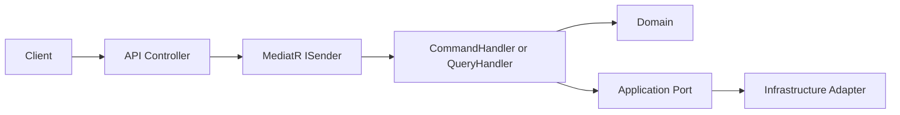
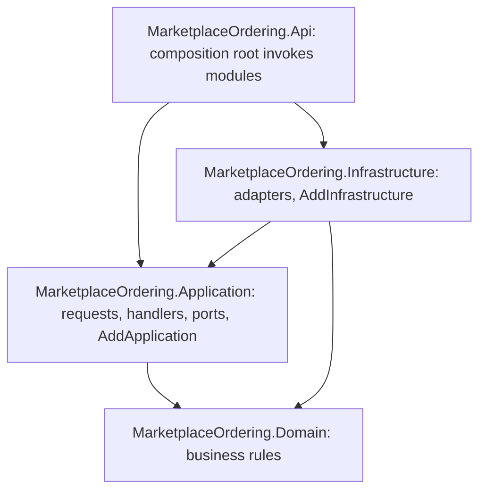
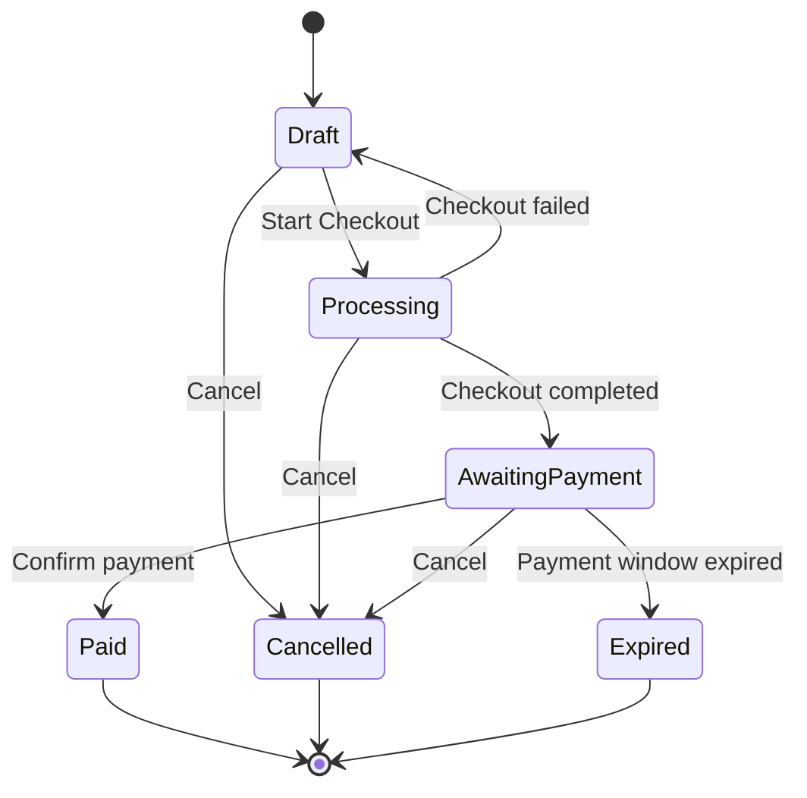
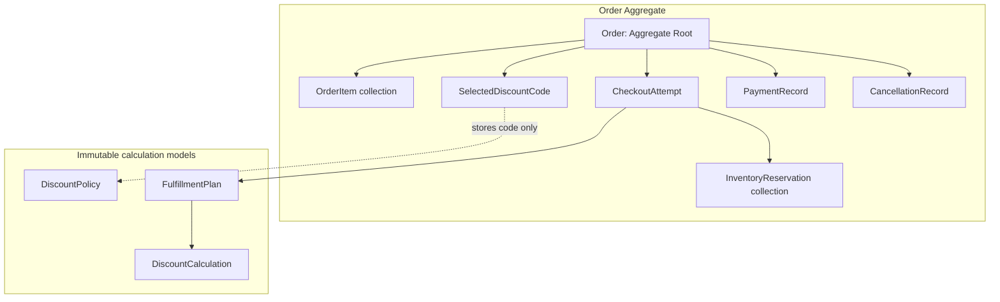
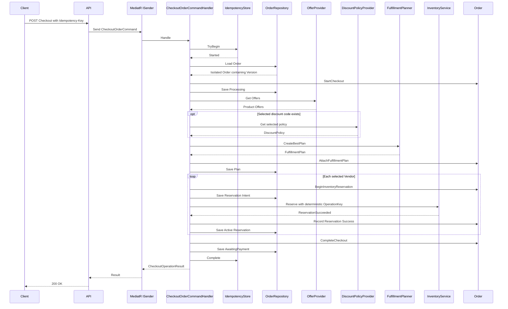
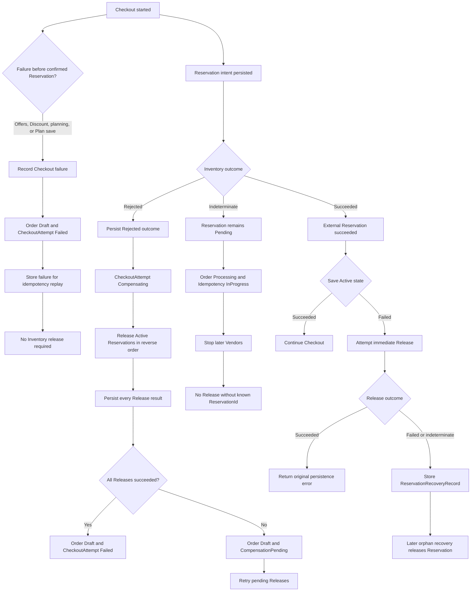
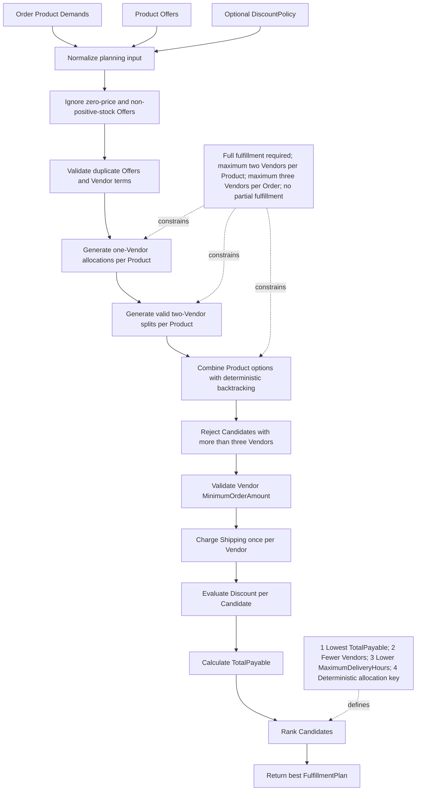
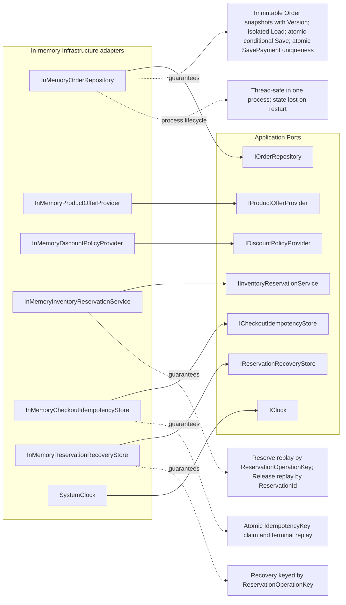
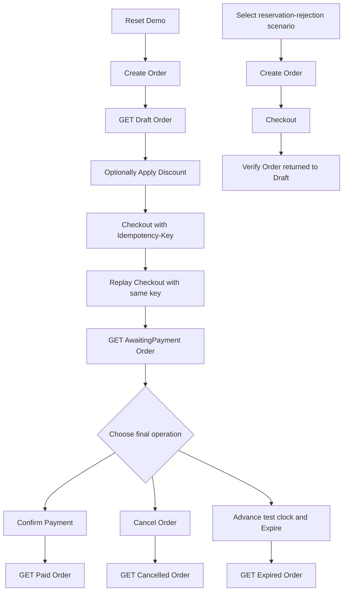

# MarketplaceOrdering

`MarketplaceOrdering` is a .NET 8 multi-vendor marketplace ordering solution created for a Senior Backend Developer technical assignment. It demonstrates a Clean Architecture implementation of order editing, exact fulfillment planning, checkout consistency, inventory reservation, payment, terminal states, recovery, and a Swagger-enabled demonstration API. It is an interview-scale system and does not claim production readiness.

## Implemented capabilities

- Order creation and draft item editing
- Discount-code selection, percentage and fixed discount evaluation, vendor eligibility, caps, and exact allocation
- Exact multi-vendor fulfillment planning with deterministic tie-breaking
- Atomic checkout idempotency claims and replay
- Inventory reservation, operation-key idempotency, compensation, and idempotent release
- Exact payment confirmation and global TransactionId uniqueness
- Cancellation and payment-window expiration
- Optimistic concurrency and isolated persistence snapshots
- Pending release retry and orphan reservation recovery
- ASP.NET Core Controllers, centralized HTTP error mapping, Swagger, and deterministic Development scenarios

## Running the project

```bash
dotnet restore MarketplaceOrdering.sln
dotnet build MarketplaceOrdering.sln
dotnet test MarketplaceOrdering.sln
dotnet run --project src/MarketplaceOrdering.Api
```

The `http` launch profile listens on the URL defined in `launchSettings.json` and opens `swagger`; the `https` profile does the same over its configured HTTPS URL. Swagger is enabled only in Development.

## Solution structure

- `MarketplaceOrdering.Domain` — Aggregate, entities, value objects, business rules, algorithms, results, and Domain Events.
- `MarketplaceOrdering.Application` — CQRS-style commands, queries, MediatR handlers, orchestration, output ports, transport-neutral response models, and its `AddApplication()` registration module.
- `MarketplaceOrdering.Infrastructure` — thread-safe in-memory implementations of Application ports and their `AddInfrastructure()` registration module.
- `MarketplaceOrdering.Api` — ASP.NET Core composition root that invokes both modules and owns controllers, HTTP contracts, error mapping, Swagger, and Development seeding.
- `MarketplaceOrdering.Domain.Tests` — isolated business-rule and algorithm tests.
- `MarketplaceOrdering.Application.Tests` — orchestration, failure-window, adapter, isolation, and concurrency tests.
- `MarketplaceOrdering.Api.Tests` — in-memory TestServer integration and architecture tests.

## Dependency direction

The production dependency direction is:

```text
Domain
  ↑
Application
  ↑
Infrastructure
  ↑
Api
```

Domain references no other project. Application references Domain. Infrastructure implements Application ports and references Application and Domain. API composes Application and Infrastructure. HTTP concepts do not appear in Domain or Application.

### Dependency injection ownership

API remains the final Composition Root and chooses which modules form the running application. Registration details stay with the layer that owns the services:

- Application owns `AddApplication()`, including MediatR assembly scanning for transient handlers, scoped `IReservationReleaseCoordinator` mapped to `ReservationReleaseCoordinator`, and singleton `ProportionalDiscountAllocator` and `FulfillmentPlanner`.
- Infrastructure owns `AddInfrastructure()`, including singleton adapters and their Application-port mappings.
- API invokes both methods and keeps only API-specific registrations such as `DemoDataSeeder`.
- Domain has no dependency on `Microsoft.Extensions.DependencyInjection` or any container abstraction.

Every stateful adapter is registered first by its concrete type and then mapped to its port by resolving that concrete registration. Consequently, demo seeding, reset operations, and Application handlers observe the exact same singleton instance rather than separate in-memory stores.

### Application dispatch

Application operations use CQRS-style request names: state changes are Commands handled by CommandHandlers, while reads are Queries handled by QueryHandlers. API controllers depend on MediatR `ISender`, map HTTP input to an Application request, and call `Send`. MediatR performs in-process dispatch; the selected Handler retains orchestration responsibility for Domain behavior, output Ports, persistence, response mapping, errors, and cancellation.

Reusable asynchronous Application workflow services expose interfaces when they coordinate ports across multiple handlers; MediatR handlers do not receive redundant per-handler interfaces, and pure deterministic algorithms remain concrete. Required constructor dependencies rely on enabled Nullable Reference Types and validated DI graphs. Runtime null guards remain at public method and configuration boundaries, while expected business validation remains Result-based.

API request models are projected into Application inputs, with collection
projections materialized once at the API boundary. Short-lived request and
response contracts expose read-only collection interfaces and keep required
collections non-null where existing validation semantics permit. Business
validation remains in Handlers and Domain; stronger defensive snapshots remain
reserved for long-lived Domain and Infrastructure state.



MediatR is confined to Application dispatch contracts and the API dispatch boundary. Domain and Domain Events remain framework-independent and do not implement MediatR notification contracts. MassTransit is intentionally not used because these operations are synchronous, in-process requests rather than distributed broker messages. MediatR also provides a conventional extension point for future pipeline behaviors, but no pipeline behaviors are currently registered.

ASP.NET Core binds each Controller action's `CancellationToken` to
`HttpContext.RequestAborted`. Controllers pass that token to `ISender.Send`;
Handlers pass the same token to every asynchronous Application Port, and the
Infrastructure adapters check it before reading or mutating in-memory state.
`OperationCanceledException` remains transport cancellation rather than a
business `Result` or API error response.

## Visual Architecture and Project Flows

The diagrams in this section summarize the project boundaries, Domain ownership, orchestration order, failure handling, and demonstration paths implemented by the solution.

### Clean Architecture Dependency Flow

Production project references point inward. Domain is the innermost project and has no dependency on Application, Infrastructure, or API.



Application depends only on Domain. Infrastructure implements Application ports and depends on Application and Domain. API composes Application and Infrastructure without moving business rules into controllers.

### Order State Machine

The Order Aggregate permits only the following business-state transitions.



Paid, Cancelled, and Expired are final business states. Technical reservation release may continue after cancellation or expiration, but cleanup never changes the final Order status.

### Order Aggregate Structure

Order is the only Aggregate Root. It owns the mutable entities whose state must remain consistent with the Order lifecycle, while calculation models remain immutable Domain results or policies.



OrderItem, CheckoutAttempt, InventoryReservation, PaymentRecord, and CancellationRecord have no independent repositories. FulfillmentPlan is an immutable calculated result attached to CheckoutAttempt. DiscountPolicy is not owned by Order; before Checkout, Order stores only the selected DiscountCode and its selection time.

### Successful Checkout Flow

Successful Checkout persists every local intent or known result before advancing to the next external operation. Idempotency is claimed before Order loading, and AwaitingPayment is durable before idempotency completion.



Processing is saved before Offer or Discount calls. The FulfillmentPlan is saved before Inventory calls. Each Reservation intent precedes Reserve, and each Active result is saved before another Vendor is processed.

The request token follows API → MediatR → Handler → Port → Adapter.
Cancellation before a confirmed external Reservation may stop the workflow.
Once Inventory confirms a Reservation, cancellation does not erase that side
effect: Checkout still attempts bounded release and records recovery when
release cannot be confirmed. This safety cleanup deliberately uses its own
five-second token because the request token is already cancelled; compensation
ordering and recovery semantics are otherwise unchanged.

### Checkout Failure and Compensation Flow

Checkout distinguishes failures with no confirmed external side effect, definitive rejection requiring compensation, indeterminate outcomes, and external success that cannot be represented in Order persistence.



Definitive rejections are persisted before compensation. Indeterminate Reserve does not trigger a guessed Release because no confirmed ReservationId exists. Orphan recovery is a safety net for a known external success that could not be saved inside Order.

### Final Order Operations

Payment, cancellation, and expiration use different Domain rules, but every persistence transition remains guarded by optimistic concurrency.

```mermaid
flowchart TD
    AWAITING["AwaitingPayment"]

    subgraph PAY["Payment"]
        AWAITING --> AMOUNT{"Exact TotalPayable?"}
        AMOUNT -->|No| WRONG["Wrong amount"]
        AMOUNT -->|Yes| VALID{"Reservations valid at PaidAt?"}
        VALID -->|No| EXPIREDRES["Expired Reservation"]
        VALID -->|Yes| CONFIRM["Confirm Payment in Domain"]
        CONFIRM --> SAVEPAY["SavePayment: Version and TransactionId atomically"]
        SAVEPAY -->|Success| PAID["Paid"]
        SAVEPAY -->|Transaction owned elsewhere| DUPLICATE["Duplicate TransactionId"]
        SAVEPAY -->|Stale Version| PAYCONFLICT["Version conflict"]
    end

    subgraph CANCEL["Cancellation"]
        CANCELABLE["Draft, Processing, or AwaitingPayment"] --> CANCELDOMAIN["Cancel in Domain"]
        CANCELDOMAIN --> SAVECANCEL["Persist Cancelled"]
        SAVECANCEL --> RELEASECANCEL["Release Active or ReleasePending Reservations"]
        RELEASECANCEL --> PERSISTCANCEL["Persist every Release result"]
    end

    subgraph EXPIRE["Expiration"]
        AWAITINGEXP["AwaitingPayment"] --> DUE{"Current time at or after PaymentExpiresAt?"}
        DUE -->|No| NOTDUE["Expiration not due"]
        DUE -->|Yes| EXPIREDOMAIN["Expire in Domain"]
        EXPIREDOMAIN --> SAVEEXPIRED["Persist Expired"]
        SAVEEXPIRED --> RELEASEEXPIRED["Release Reservations"]
        RELEASEEXPIRED --> PERSISTEXPIRED["Persist every Release result"]
    end
```



Cancelled and Expired are persisted before Inventory Release. A failed Release does not reverse either final state; it remains ReleasePending for retry. Payment and expiration races are resolved by optimistic concurrency, so only one Save using the same loaded `Order.Version` succeeds.

### Fulfillment Planning Flow

Fulfillment planning enumerates complete valid allocations, calculates each candidate independently, and ranks them deterministically.



The algorithm never selects a partial plan. Discount is evaluated against each candidate's Vendor product amounts, while Shipping remains outside discount calculation.

### Infrastructure Consistency Model

Infrastructure adapters implement the Application ports with process-local, thread-safe state. The diagram describes local atomicity and idempotency; it does not imply a distributed ACID transaction.



The Order repository stores snapshots rather than Aggregate references, and every Load rehydrates a new Aggregate. All multi-step checks and state mutations use explicit synchronization inside their owning adapter. Concrete adapters and their port interfaces resolve to the same singleton instances.

### Recommended Swagger Demo Flow

The Development demo can exercise both a complete successful flow and a deterministic Reservation rejection without editing source code.



SystemClock cannot be advanced through the public demo API; the expiration branch uses the controllable clock supplied by API integration tests. Swagger users can exercise payment or cancellation directly and use the documented failure scenarios.

## Domain model

`Order` is the only Aggregate Root and protects every state transition requiring consistency across its contents:

- `OrderItem` stores ProductId, a ProductName snapshot, and Quantity.
- `SelectedDiscountCode` records the selected normalized code and selection time.
- `CheckoutAttempt` owns planning, reservation, compensation, and completion state.
- `InventoryReservation` records reservation intent, external identity, expiry, release, and retry progress.
- `PaymentRecord` records the globally unique TransactionId, exact amount, and PaidAt.
- `CancellationRecord` preserves reason, time, and the previous Order status.
- `FulfillmentPlan` is an immutable calculated result.
- `DiscountPolicy` is an immutable rule definition evaluated during planning.

Internal entities do not have repositories because they are not independent consistency boundaries. Persisting them separately would allow state that bypasses Order invariants.

## State machines

Order transitions:

```text
Draft           → Processing
Processing      → AwaitingPayment
Processing      → Draft
Draft           → Cancelled
Processing      → Cancelled
AwaitingPayment → Paid
AwaitingPayment → Cancelled
AwaitingPayment → Expired
```

CheckoutAttempt statuses are `Planning`, `Reserving`, `FullyReserved`, `Compensating`, `CompensationPending`, `Failed`, and `Completed`.

InventoryReservation statuses are `Pending`, `Active`, `Rejected`, `ReleasePending`, and `Released`.

Order status represents the business outcome. `ReleasePending` and `CompensationPending` separately represent technical cleanup, so cleanup failure cannot reverse a persisted business state.

## Money model

The assignment is single-currency. `Money` stores a non-negative `long` in the marketplace's smallest monetary unit. There is no floating-point monetary arithmetic and no Currency model because multi-currency behavior is outside scope. Addition, subtraction, and multiplication use checked arithmetic. Percentage discounts round once with `MidpointRounding.ToEven`.

## Discount model

- Fixed and percentage discounts are distinct immutable types.
- Percentage is greater than zero and no more than 30.
- Policies support active state, date windows, minimum product amount, maximum discount, and eligible Vendors.
- `MinimumProductsAmount` is checked against the complete product amount.
- Discount applies only to eligible Vendor product amounts; Shipping is never discounted.
- The Largest Remainder Method allocates the exact discount total.
- Equal allocation remainders use VendorId as a deterministic tie-break.
- Allocated Vendor discounts always conserve the calculated total.

## Fulfillment algorithm

Only complete fulfillment is accepted. One Product may use at most two Vendors and one Order at most three. Candidate construction enforces stock, Vendor minimum order amount, consistent Vendor terms, and Shipping once per selected Vendor.

Candidates are ranked by:

1. Lowest TotalPayable.
2. Fewer Vendors.
3. Lower maximum delivery time.
4. Deterministic allocation sequence.

The implementation performs exact allocation enumeration followed by deterministic backtracking. Worst-case complexity is exponential in Product count, which is acceptable for the bounded assignment problem. Production alternatives include branch-and-bound, dominance pruning, CP-SAT, or MILP.

## Checkout consistency model

Checkout uses this ordering:

```text
Claim idempotency
Load Order
Persist Processing
Fetch Offers and Discount
Create Plan
Persist Plan
Persist Reservation intent
Call Reserve
Persist Reservation result
Complete Checkout
Persist AwaitingPayment
Complete idempotency
```

`ReservationOperationKey` deterministically identifies `Order + CheckoutAttempt + Vendor`. Intent is persisted before the external call, and every known outcome is persisted before proceeding. There is no distributed transaction; optimistic local persistence, idempotent external identities, compensation, and recovery cover the relevant failure windows.

## Failure and crash-window handling

- Definitive Reservation rejection records failure and compensates confirmed Reservations in reverse acquisition order.
- Release failure becomes `ReleasePending`; incomplete compensation becomes `CompensationPending`.
- An indeterminate Reservation leaves the attempt Processing and the idempotency entry InProgress.
- If external Reserve succeeds but Order persistence fails, immediate idempotent Release is attempted.
- If that cleanup cannot be confirmed, `IReservationRecoveryStore` records an orphan Reservation.
- If Order completion persists but idempotency completion fails, an InProgress replay reconciles from persisted Order state.
- Pending Order-owned releases and orphan recovery records have separate Application recovery handlers.

## Payment

Payment is allowed only from AwaitingPayment. Amount must exactly match FulfillmentPlan TotalPayable, all required Reservations must remain Active, and PaidAt must be strictly before every Reservation expiration. Replaying the same TransactionId and amount is idempotent and preserves the original PaidAt.

`SavePaymentAsync` atomically combines `Order.Version` validation, global TransactionId ownership, snapshot persistence, and version increment. Payment and expiration racing from one loaded Version cannot both persist.

## Cancellation and expiration

Draft, Processing, and AwaitingPayment Orders may be cancelled. Cancellation and expiration persist the final business state before attempting Reservation release. Expiration is allowed at or after PaymentExpiresAt; the exact boundary is valid for expiration and invalid for payment. Replays preserve the original reason/time or ExpiredAt. Cleanup failures do not reverse Cancelled or Expired state.

## Persistence and concurrency

Infrastructure is intentionally in-memory. `InMemoryOrderRepository` stores explicit immutable snapshots, never caller Aggregate references. `OrderPersistenceSnapshot` represents the complete database row, including the persistence concurrency token in `Version`. Every Load rehydrates an isolated Aggregate, restores that exact Version, and creates no pending Domain Events.

A newly created Order starts at Version `0`; its first successful persistence changes it to `1`, and every successful Save increments it exactly once. Save compares the persisted snapshot Version with `Order.Version` before replacing the snapshot, preventing lost updates. Payment save validates Version and TransactionId ownership under the same lock. Domain Events are committed only after successful snapshot storage; every failure leaves Version and pending Events intact.

Version is technical persistence state: business logic never reads or changes it, API inputs never accept it, and only Infrastructure restores or advances it after successful persistence. A future EF Core adapter would map `Order.Version` as a concurrency token; this solution deliberately keeps the current in-memory adapter and adds no persistence attributes to Domain. State is process-local and is lost on restart.

## Domain Events

Domain Events are framework-independent records. Domain has no MediatR, broker, dispatcher, or handler dependency. The repository commit boundary clears successfully persisted pending Events. A production extension could persist them atomically to an Outbox and dispatch asynchronously.

## Testing strategy

- Domain unit tests cover value objects, Aggregate rules, discount allocation, and exact fulfillment.
- Application tests cover orchestration, idempotency, compensation, crash windows, payment races, cancellation, expiration, and recovery.
- Infrastructure tests cover snapshots, isolation, atomic version checks, TransactionId uniqueness, stock concurrency, replay, and thread safety.
- API tests use `WebApplicationFactory<Program>`, `HttpClient`, real MediatR dispatch and Application handlers, real Domain behavior, real adapters, deterministic seed data, and a controllable test clock.
- Concurrency tests coordinate tasks without timing delays. No test depends on execution order and no test is skipped.

Final verified count: **393 passing tests**.

## Demo scenarios

Fixed IDs:

| Name | ID |
|---|---|
| Customer | `10000000-0000-0000-0000-000000000001` |
| Product A | `20000000-0000-0000-0000-000000000001` |
| Product B | `20000000-0000-0000-0000-000000000002` |
| Vendor 1 | `30000000-0000-0000-0000-000000000001` |
| Vendor 2 | `30000000-0000-0000-0000-000000000002` |
| Vendor 3 | `30000000-0000-0000-0000-000000000003` |

The default demand example uses Product A Quantity 3 and Product B Quantity 2. Vendor 1 plus Vendor 2 totals 635 using two Vendors. Vendor 3 also totals 635 using one Vendor, so deterministic ranking selects Vendor 3.

Discount codes are `SAVE10`, `FIXED50`, `VENDOR3`, and `INACTIVE`.

Development endpoints:

- `POST /api/demo/reset`
- `POST /api/demo/scenarios/default`
- `POST /api/demo/scenarios/reservation-rejection`
- `POST /api/demo/scenarios/reservation-indeterminate`
- `POST /api/demo/scenarios/release-failure`
- `POST /api/demo/reservation-recovery/run?maximumCount=100`

Business endpoints include Order creation/editing/query, Checkout, Payment confirmation, cancellation, expiration, and pending-release retry. Checkout requires the `Idempotency-Key` header.

Suggested Swagger flow:

1. Reset demo.
2. Create an Order with Product A Quantity 3 and Product B Quantity 2.
3. Optionally apply `SAVE10`.
4. Checkout using an `Idempotency-Key` header.
5. Confirm Payment, cancel, or advance time in a test and expire.
6. GET the Order to inspect final state.

Demo endpoints return 404 outside Development.

## Assumptions

- One currency is used.
- ProductName is a snapshot; re-adding ProductId preserves its original name.
- Maximum Quantity is 10 per Product.
- Price is resolved during Checkout.
- A Vendor's ShippingCost and MinimumOrderAmount must be consistent across its Offers.
- Delivery time may differ per Product Offer.
- Minimum discount threshold uses total product amount.
- Order retains one current CheckoutAttempt.
- Reservation lifetime is exactly 15 minutes.
- External operations are idempotent by their operation identity.

## Production evolution

A production system would introduce a relational database, database transactions for local atomic state, unique constraints, durable idempotency and recovery tables, a durable Outbox, real inventory/offer clients, adapter retry and timeout policies, a background recovery worker, observability, authentication, authorization, rate limiting, secrets management, and a horizontal-scaling strategy. Cross-system workflows would still avoid assuming a distributed transaction.

## Trade-offs

- One Aggregate gives strong ordering consistency; multiple Aggregates could improve independent scaling but require more coordination.
- Exact search guarantees the assignment's optimal result; a solver or pruned search is more suitable at larger scale.
- Explicit in-memory snapshots demonstrate isolation and concurrency without introducing EF Core.
- MediatR request-handler contracts keep orchestration discoverable without adding one custom interface per operation; this introduces an in-process dispatch dependency in Application while keeping Domain independent.
- Domain Events model facts without requiring a dispatcher in this scope.
- The API is included for demonstration and integration verification, not as a production edge design.
- Currency and a separate OrderItems abstraction were avoided because current requirements do not justify them.
